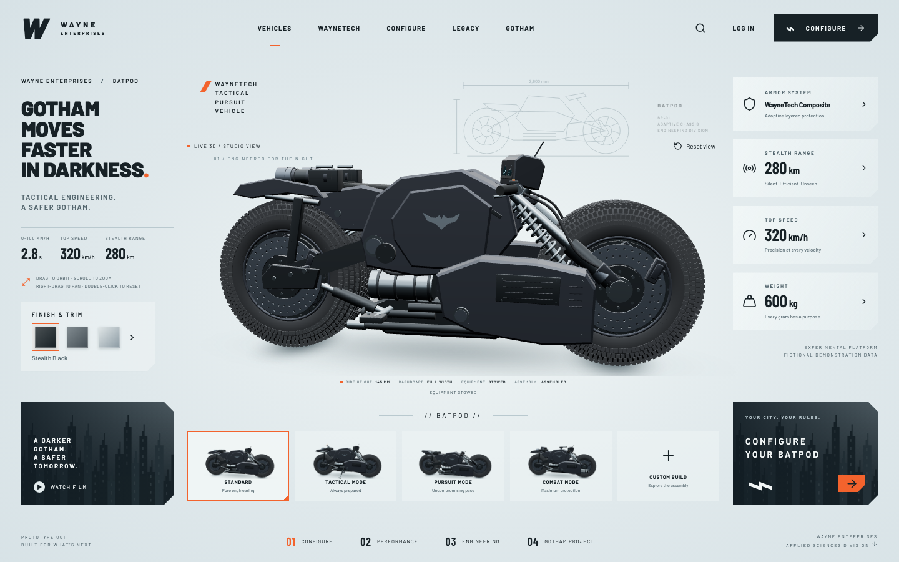

# BATPOD / Wayne Enterprises

A fictional engineering showroom built with Vite, React, strict TypeScript, Three.js, React Three Fiber and Drei. Code-generated geometry forms the vehicle; no downloaded vehicle model or reference-video imagery is rendered in the application.



## Experience

- Broad crown tires with instanced tread and sidewall blocks, perforated brake rotors, bolted hubs, boxed swingarms, suspension springs, hoses, cylinder housings, layered armor, digital cockpit and equipment modules.
- Three PBR armor finishes and four typed configuration presets.
- Smooth, interruptible assembly separation in Custom Build.
- Camera inspection, reset and a stoppable cinematic orbit.
- Specification dialogs, configuration search, demo login information and editorial panels.
- Responsive layout, locally packaged fonts, procedural SVG diagrams and static thumbnails rendered from the actual vehicle.

All performance figures are fictional. Standard uses 2.8 s acceleration, 320 km/h top speed, 280 km stealth range and 600 kg mass. This independent design study is not affiliated with DC, Warner Bros. or any real vehicle manufacturer.

## Setup

Node.js 22 and npm are required.

```sh
npm ci
npm run dev
```

Open `http://localhost:5173/wayne-enterprises/`.

## Controls

| Action               | Control                                                       |
| -------------------- | ------------------------------------------------------------- |
| Orbit                | Drag inside the viewer                                        |
| Zoom                 | Scroll or pinch                                               |
| Pan                  | Right-drag; two-finger drag on touch                          |
| Reset camera         | Double-click viewer or activate Reset view                    |
| Change armor finish  | Select a labeled finish swatch                                |
| Change configuration | Select a preset                                               |
| Explode assembly     | Select Custom Build                                           |
| Reassemble           | Select any normal preset                                      |
| Film tour            | Watch Film; Stop film, Escape or manual camera input stops it |
| Dialog               | Tab cycles within the panel; Escape or Close dismisses it     |

On touch screens, gestures inside the viewer manipulate the vehicle; scroll from outside the viewer to move the page. Reset and all finish/preset controls work with the keyboard. Camera rotation itself uses pointer/touch input.

## Commands

| Command                | Purpose                                                  |
| ---------------------- | -------------------------------------------------------- |
| `npm run dev`          | Development server                                       |
| `npm run build`        | Strict type checking and production build                |
| `npm run preview`      | Serve production build locally                           |
| `npm run format`       | Apply Prettier                                           |
| `npm run format:check` | Verify formatting                                        |
| `npm run lint`         | ESLint, TypeScript and React Hooks rules                 |
| `npm run typecheck`    | Strict TypeScript checking                               |
| `npm run test`         | Unit tests                                               |
| `npm run test:e2e`     | Chromium browser smoke tests                             |
| `npm run check`        | Formatting, lint, types, unit tests and production build |

Install the browser once with `npx playwright install chromium` (CI uses `--with-deps`). Browser tests cover startup, presets, finish preservation, repeated assembly selections, dialog focus, keyboard activation, reset controls, film dismissal, search, mobile overflow, reduced motion and WebGL fallback.

## Architecture

- `src/App.tsx`: application layout, configuration reducer and secondary flows.
- `src/config.ts`: explicit IDs, preset specifications, reducer, stable assembly targets and delta-aware damping.
- `src/components/`: shared native dialog and procedural SVG artwork.
- `src/scene/Vehicle.tsx`: independent animated assemblies and vehicle construction.
- `src/scene/Wheel.tsx`, `parts.tsx`, `Details.tsx`: instanced tires and fasteners, drilled rotors, springs, hoses and suspension links.
- `src/scene/geometry.ts`: shared panel profiles, broad tire cross-section and perforated rotor geometry.
- `src/scene/Bodywork.tsx`, `Chassis.tsx`, `Equipment.tsx`: detailed body shells, drivetrain and preset-specific equipment.
- `src/scene/Motion.tsx`: interruptible assembly and mechanism transforms, including stowing and deployment.
- `src/scene/materials.ts`: separately owned PBR materials and finish mapping.
- `src/scene/Viewer.tsx`, `StudioFloor.tsx`: lighting, local environment generation, procedural floor shadows and rendering fallbacks.
- `src/scene/CameraRig.tsx`: bounded orbit controls, responsive field of view, reset and interruptible tour.
- `src/hooks.ts`: reduced-motion subscription and WebGL capability check.
- `src/styles.css`: shared design tokens, component styles and responsive composition.
- `tests/`: pure calculations and Playwright browser tests; all test code is strict TypeScript.

Animation values live in Three.js objects and refs. Fixed targets prevent accumulated offsets; long frame deltas are bounded. Rendering is demand-driven, with animation frames requested only while transitions, camera movement the tour, or Combat rotary equipment need them. Pixel ratio is capped at 1.6. Three shared procedural floor gradients provide body and tire contact shadows, avoiding extra full-scene shadow passes while moving with wheelbase changes. Materials and manually constructed armor geometry are disposed, and browser listeners are removed. This is not a measured frame-rate guarantee.

## Reference and limitations

The supplied 54-second local video was reviewed across its entire timeline at two-second intervals, with full-resolution inspections of the stable presets and assembly transitions. The layout follows its pale studio, technical drawing, left editorial stack, right specification cards and lower configuration rail. Assembled and exploded screenshots were visually reviewed against those frames.

The vehicle is an original procedural interpretation with simplified mechanical construction. Preset thumbnails are static renders of the procedural model; they do not run additional WebGL canvases. The film is an in-app orbit, with no prerecorded media or audio. Authentication, purchases and saved accounts are not implemented. The WebGL dependency bundle is substantial; lower-powered devices may need more time to initialize. Only Chromium is automated; Safari, Firefox and physical touch devices need further verification. See [ACCESSIBILITY.md](ACCESSIBILITY.md).

### Preset differences observed in the reference

| Approximate video interval | Preset       | Implemented mechanical changes                                                                                                 |
| -------------------------- | ------------ | ------------------------------------------------------------------------------------------------------------------------------ |
| 00–06 s; 50–54 s           | Standard     | Neutral ride height, full cockpit, folded supports, retracted mission equipment                                                |
| 06–12 s                    | Tactical     | Raised suspension, lowered stabilizers, raised rear grapple, illuminated headlights                                            |
| 12–24 s                    | Pursuit      | Lower chassis, extended wheelbase, compact cockpit, rear-set foot controls, raised spoiler, extended illuminated aft thrusters |
| 24–38 s                    | Combat       | Extended rotary assemblies, open launcher panels, raised turret and rear missile pod; full cockpit                             |
| 38–50 s                    | Custom Build | Seat, cockpit and tank lift; opposite armor and equipment shells move outward; wheels retain their relationship to the chassis |

The typed preset data controls both visible equipment and HTML status descriptions. Combat uses the reference's 300 km/h, 250 km and 690 kg figures; Standard retains the requested baseline. Reference dimensions and specifications remain fictional. The model is an original procedural reconstruction, not the source asset or an exact geometric reproduction. Camera framing widens smoothly for the exploded assembly without resetting its orientation; manual input interrupts automatic framing.

## GitHub Pages

The detected production branch is `main`, and Vite's base is `/wayne-enterprises/` for `Hostlife22/wayne-enterprises`.

1. In **Settings → Pages → Build and deployment**, select **GitHub Actions**.
2. Allow Actions to run. The `github-pages` environment must permit deployments from `main`; configure required reviewers there if desired.
3. Push to `main`, or run **Check and deploy showroom** manually on `main`.

Pull requests run `npm ci`, all checks and Chromium smoke tests. Production deployment depends on the same successful checks. All actions are pinned to full revisions; only the deployment job receives Pages write and OIDC permissions. No repository secret is required. A post-deploy HTTP check verifies the page title. For a renamed repository, update `base` in `vite.config.ts` and the test URLs. For a branch rename, update both the workflow branch filter and deployment conditions.

Expected site: https://hostlife22.github.io/wayne-enterprises/. Deployment status must be checked in Actions and the live site verified before treating it as published.

## Repository metadata

Suggested description: **A cinematic 3D Batpod configurator with procedural engineering, live finishes and animated exploded assembly.**

Suggested topics: `react`, `typescript`, `threejs`, `react-three-fiber`, `vite`, `3d-configurator`, `webgl`, `github-pages`.

## License

Original application code: [MIT](LICENSE), copyright Serafim Sen (GitHub: Hostlife22). Barlow fonts retain their SIL Open Font License in the installed Fontsource packages. React, Three.js, Drei, Lucide and other dependencies retain their own licenses. Referenced fictional names and marks are not licensed by this repository's MIT license. The source video is excluded from version control and deployment.
